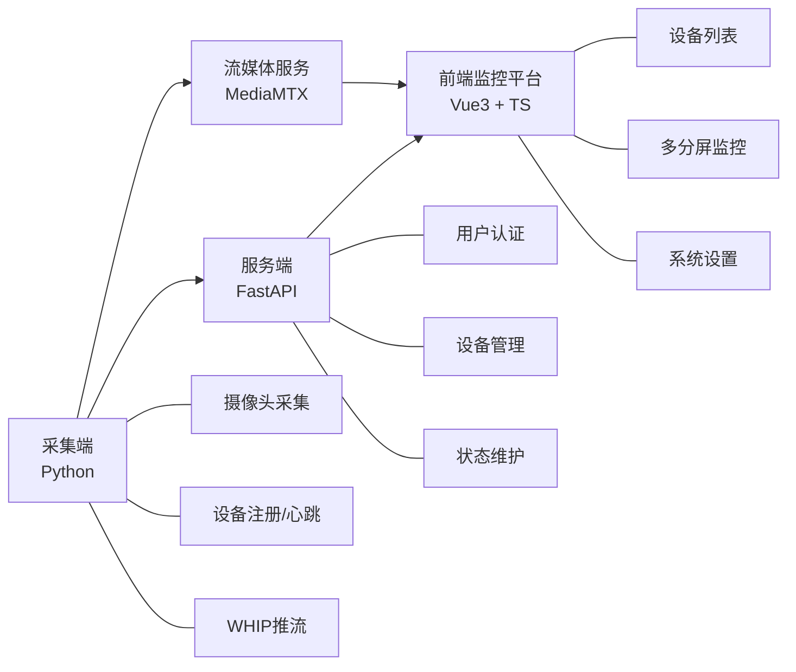

# 用于电厂内巡检机器人的端到端无线视频传输设计

  王帅｜自动化工程学院｜自动卓越221班

  毕业论文答辩汇报

  建议讲解时长：约 4~5 分钟

---
layout: two-cols
---

# 汇报内容

1. 课题背景与研究意义
2. 系统实现功能与总体设计
3. 项目亮点、总结与展望

::right::

# 选题目标

围绕电厂巡检机器人场景，完成一套：
- 可接入
- 可管理
- 可播放
- 可扩展

的端到端无线视频传输系统。

---

# 一、课题背景与研究意义

- 电厂巡检环境复杂，存在高温、高压、强噪声、粉尘和电磁干扰等风险
- 传统人工巡检效率受经验影响大，进入危险区域成本高
- 巡检机器人能够代替人员进入现场，但前提是**现场画面必须稳定回传**
- 对远程值班人员而言，视频不是附属信息，而是判断设备状态的直接依据

### 本课题的意义

- 提高巡检实时性与安全性
- 降低人工巡检风险
- 为后续智能识别、异常检测和多机器人协同提供基础

---

# 二、系统总体设计

- 业务链路与媒体链路分离
- 通过 `device_id` 统一关联设备信息与视频流路径

---
layout: two-cols
---

# 二、实现功能

### 1. 采集端功能
- 摄像头接入
- 设备注册
- 周期性心跳上报
- WHIP 推流到 MediaMTX

### 2. 服务端功能
- 用户登录认证
- 设备列表管理
- 在线状态维护
- 流状态信息接收

::right::

# 二、实现功能

### 3. 前端功能
- 登录页
- 设备管理页
- 实时监控页
- 系统设置页

### 4. 播放能力
- WHEP 拉流
- WebRTC 低延迟播放
- 1 / 4 / 9 / 16 分屏切换
- 全屏、关闭、错误提示

---

# 二、关键设计与实现思路

### 设备接入闭环
- 采集端启动后先注册设备，再启动心跳，再发起推流
- 服务端根据心跳更新时间判断设备在线/离线
- 前端根据在线设备列表选择需要播放的目标

### 视频播放闭环
- 采集端：`WHIP` 推流
- 流媒体服务：`MediaMTX` 转发
- 浏览器端：`WHEP + WebRTC` 播放

### 工程实现特点
- 各层职责清晰，便于联调和排错
- 不让业务后端中转媒体流，降低服务压力

---

# 三、项目亮点

### 亮点 1：面向真实业务场景
不是单纯播放视频，而是面向电厂巡检场景完成“设备接入 + 状态维护 + 实时监控”的闭环设计。

### 亮点 2：低延迟链路清晰
采用 `WHIP/WHEP + WebRTC + MediaMTX` 方案，适合浏览器端实时查看现场画面。

### 亮点 3：设备管理与视频路径统一
通过 `device_id` 统一设备信息、心跳状态和视频流路径，便于管理与扩展。

### 亮点 4：具备扩展基础
已为弱网优化、状态上报、AI识别等后续功能预留接口与结构。

---
layout: two-cols
---

# 三、总结

- 完成了端到端无线视频传输原型系统
- 实现了采集端、服务端、流媒体服务、前端监控平台协同工作
- 打通了“设备注册—心跳维护—视频推流—网页播放”的核心链路
- 具备毕业论文和原型演示所需的完整性

::right::

# 三、未来展望

- 完善弱网自适应策略
- 增强多设备并发能力
- 继续优化安全认证机制
- 接入智能识别与告警分析模块
- 面向真实电厂环境进行更长时间稳定性测试

---

# 谢谢各位老师

请批评指正

说明：本PPT内容控制在 8 页内，正常讲解约 4~5 分钟。

